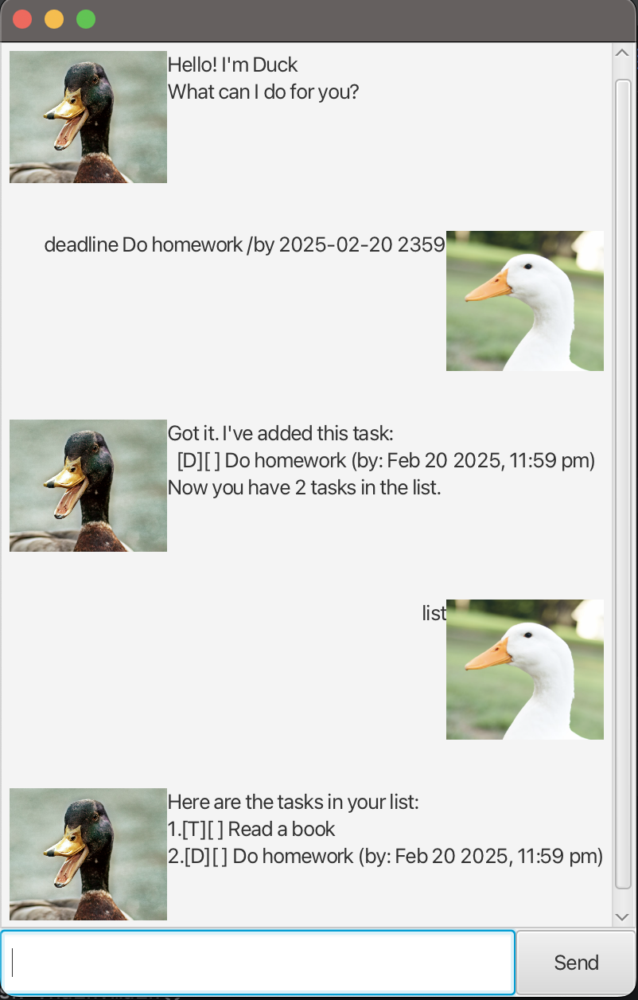

# Duck User Guide

Duck is a chat bot that helps you stay on top of your tasks.
## Features
This application allows you to manage tasks with various features:
### Task Management
- **Add Todo**: Create a simple task without a date.
    - Command: `todo [description]`
- **Add Deadline**: Create a task with a specific deadline.
    - Command: `deadline [description] /by [yyyy-MM-dd HHmm]`
- **Add Event**: Create an event with a start and end time.
    - Command: `event [description] /from [yyyy-MM-dd HHmm] /to [yyyy-MM-dd HHmm]`
- **Add Recurring Task**: Create a recurring task with a specified frequency.
    - Command: `recurring [description] /at [yyyy-MM-dd HHmm] /every [day|week|month]`

### Task Manipulation
- **List Tasks**: View all tasks.
    - Command: `list`
- **Mark Task as Done**: Mark a task as completed.
    - Command: `mark [task number]`
- **Unmark Task**: Mark a task as incomplete.
    - Command: `unmark [task number]`
- **Delete Task**: Remove a task from the list.
    - Command: `delete [task number]`

### Additional Commands
- **Find Task**: Search for tasks containing a specific keyword.
    - Command: `find [keyword]`
- **Help**: Display a help message with available commands.
    - Command: `help`
- **Exit**: Close the application.
    - Command: `bye`

Enjoy using Duck for managing your tasks!